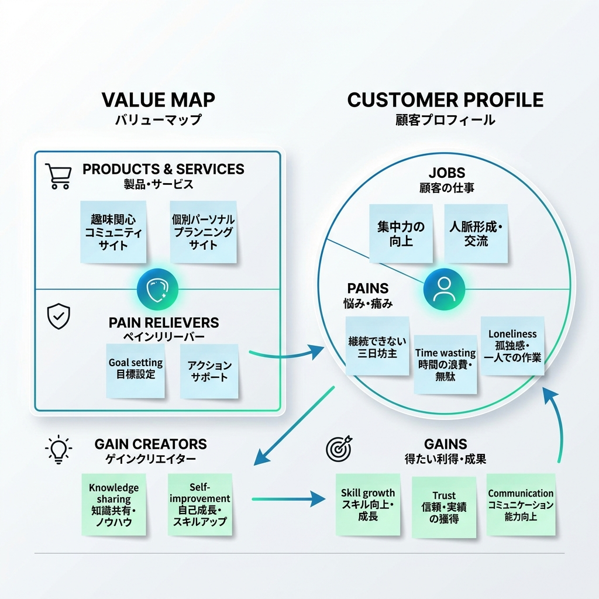

# VPC v1 - masa027543

> 「**自分や周りの人を顧客に設定**」したVPC。13週後の自分が欲しいもの・身近な人のために作りたいものを設計する。
> v1 でいい。完璧を目指さない。第6回でアップデート(v2)します。

---

## 1. 解決したい困りごとを 1つ 選ぶ

> [`bug-list.md`](./bug-list.md) の20個から、**「自分が一番これを解決したい!」と思うもの** を1つ選んでください。
> 1つに絞れなければ、複数候補を書いてOK(後で絞り込みます)。

**選んだ困りごと**:

集中力が続かない（重要な物事が続かない、時間の無駄遣いをしてしまう）

---

## 2. その解決策のアイデアを書く

> 選んだ困りごとに対する「**こうだったらいいのに**」を1つ書く。
> 現実性は気にせず、自由に発想。

**解決のアイデア**:

同じ悩みを持つ人と交流しながら、自分に合った計画を立てて実行を支援してくれるサイト

---

## 3. VPC本体

> 上で選んだ「困りごと」と「解決のアイデア」を起点に、6要素を埋めていきます。

### 🟦 Customer Profile(顧客=自分自身)

#### Jobs(やりたいこと・動詞で書く)

- 集中力を伸ばしたい
- いろいろな人と話したい

#### Pains(困っていること)

- 重要な物事が続かない
- 時間の無駄遣い
- 一人が寂しい
- お金の無駄遣い

#### Gains(得たい未来・状態)

- 自分の力がつく
- 信頼が生まれる
- コミュニケーション能力を伸ばせる

---

### 🟧 Value Map(あなたが作るもの)

#### Products & Services

- 同じ悩みを持つ人と話せるサイト
- 自分に合った計画を教えてくれるサイト

#### Pain Relievers

- 計画性を持つ
- 自分で決めた予定を実行する

#### Gain Creators

- 人と話すことで知見を得られる
- 理想の自分になれる

---

## 4. Fit確認(整合チェック)

| Pains/Gains | ↔ | Pain Relievers / Gain Creators | チェック |
|---|---|---|---|
| 重要な物事が続かない | ↔ | 計画性を持つ | ✓ |
| 時間の無駄遣い | ↔ | 自分で決めた予定を実行する | ✓ |
| 一人が寂しい | ↔ | 人と話すことで知見を得られる | ✓ |
| 自分の力がつく | ↔ | 理想の自分になれる | ✓ |
| 信頼が生まれる | ↔ | 同じ悩みを持つ人と話せるサイト | ✓ |

> 整合しないものは「自分が作りたいだけ」のプロダクトになりがち。
> 迷ったら AI大学講師に壁打ち。
